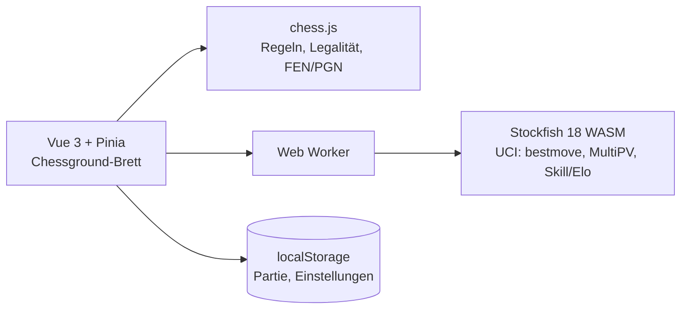

# ♞ SchachTrainer

Kleine, private Schach-Web-App zum Spielen und Lernen — komplett offline-fähig,
ohne Backend, ohne Accounts. Kernfeature: konfigurierbare Tipps, die den besten
nächsten Zug zeigen und auf Deutsch erklären, warum er gut ist.

## Features (Stand: G1 + G2 + Lernpfad)

- **Lernpfad („Fahrschule“)** 🎓: 13 Lektionen in 5 Stufen — goldene Regeln,
  Eröffnungen (Italienisch, London, Damengambit, Blackmar-Diemer …), Taktik-
  Grundmuster und Matt-Techniken. Jede Lektion als „Film“ ansehen (jeder Zug
  wird per „Weiter“-Knopf im eigenen Tempo abgespielt) oder geführt mitspielen:
  Der Coach markiert die Figur, erklärt den Zug vorab, und beim Fehlversuch
  zeigt sofort ein Pfeil den Lektionszug. 1–3 Sterne je Durchlauf
  (fehlerfrei = 3), Stufen schalten sich nacheinander frei, und am Ende
  heißt es „Ab hier weiterspielen“ gegen den Computer. Lektionen sind
  kommentierte PGNs (`src/lessons/data/`) — neue Inhalte sind reine Daten,
  jede Lektion wird im Unit-Test auf Legalität aller Züge geprüft.

- **Spieler vs. Computer** — Stockfish 18 (WASM) mit 5 Spielstärken (~800–2300 Elo)
- **Spieler vs. Spieler (Hotseat)** — zu zweit an einem Gerät, optional mit Brettdrehung nach jedem Zug
- **Tipp-System mit Budget** (0 / 3 / 5 / 10 / ∞) und drei eskalierenden Stufen:
  1. Welche Figur sollte ziehen? (Feld wird markiert)
  2. Bester Zug als Pfeil auf dem Brett
  3. Deutsche Erklärung, *warum* der Zug gut ist (regelbasiert: Matt, Materialgewinn, Gabel, Hängefigur, Rochade …)
- **Fehlerwarnung** (abschaltbar): Nach einem groben Patzer (Bewertungssprung > 2 Bauern) fragt die App, ob der Zug zurückgenommen werden soll — kostet kein Tipp-Budget
- **Legale Züge werden immer angezeigt** (Punkte auf den Zielfeldern) — zentrales Lernfeature
- Bewertungsbalken (zuschaltbar), Zugliste in deutscher Notation, geschlagene Figuren + Materialbilanz
- Umwandlungsdialog, Schach-/Matt-Anzeige, Zug-Animationen, Sounds (WebAudio-synthetisiert), Vibration auf Mobilgeräten
- PGN-Export (auf Mobilgeräten per Teilen-Dialog, eindeutige Dateinamen mit Zeitstempel)
- **Partie-Archiv**: die letzten 12 Partien bleiben automatisch erhalten
  (Einstellungen → Partie-Archiv, je Partie als PGN exportierbar)
- Partie und Einstellungen überleben ein Neuladen (localStorage)
- **PWA**: als App auf dem Homescreen installierbar, läuft danach vollständig offline (Engine-WASM wird mitgecacht, ~7 MB)

## Stack

| Baustein | Bibliothek |
|---|---|
| Framework | Vue 3 + Pinia + Vite |
| Schachregeln | chess.js |
| Brett-UI | chessground (Lichess-Board) |
| Engine | Stockfish 18 lite (Single-Thread-WASM, im Web Worker) |
| Offline | vite-plugin-pwa (Workbox) |

**Lizenzhinweis:** chessground und Stockfish stehen unter GPL-3 — für die private
Nutzung unproblematisch; bei einer Veröffentlichung als Produkt muss der Code
GPL-kompatibel offengelegt oder das Board/die Engine ersetzt werden.

## Offline nutzen (wichtig)

Die App braucht **kein** Netz zum Spielen — Engine, Tipps und Erklärungen laufen
komplett lokal. Damit das funktioniert, muss der Browser die App aber einmal
vollständig cachen dürfen:

1. Die App **über den HTTPS-Link** öffnen (z. B. `https://….ts.net`).
   Über `http://` (z. B. eine nackte Tailscale-IP) registriert der Browser
   **keinen** Service Worker — dann ist nichts offline verfügbar!
2. Kurz warten, bis unten die Meldung **„✓ Bereit für Offline-Spiel“**
   erscheint (beim ersten Besuch, lädt ~7 MB inkl. Engine).
3. Optional über das Browser-Menü **„Zum Startbildschirm hinzufügen“**.

Ab dann funktioniert alles ohne Internet/Tailnet — auch Computergegner,
Tipps und Zug-Kommentare.

## Entwicklung

```bash
pnpm install       # kopiert dabei auch die Engine nach public/engine
pnpm dev           # Dev-Server
pnpm test          # Vitest (Erklärungs- und Bewertungsmodul)
pnpm build         # Produktions-Build nach dist/
pnpm preview       # Build lokal testen

# End-to-End-Tests (echter Chromium, testet Engine, Tipps, Warnungen, Offline …)
npx playwright install chromium   # einmalig, falls kein Browser vorhanden
pnpm build && pnpm test:e2e
```

Die Stockfish-Dateien werden per `postinstall` aus `node_modules/stockfish/bin`
nach `public/engine/` kopiert (nicht eingecheckt).

## Deployment

Statischer Build (`dist/`) — z. B. auf Coolify als Static Site unter
`schach.apps.hakobu.eu`. Es sind **keine** besonderen Header nötig: die App
nutzt bewusst die Single-Thread-Engine, die ohne COOP/COEP auskommt und auf
Mobilgeräten zuverlässig läuft.

## Architektur



- `src/engine/engine.ts` — serialisierter UCI-Wrapper um den Stockfish-Worker
  (eine Engine-Instanz für Gegnerzüge, Tipps und Bewertung)
- `src/stores/game.ts` — Spiellogik, Tipp-Stufen, Fehlerwarnung, Persistenz
- `src/lib/explain.ts` — regelbasierte deutsche Zugerklärungen (Tipp-Stufe 3)

## Roadmap

- **G3 — Trainingsmodus:** Taktik-Puzzles (kuratierte Teilmenge der Lichess-Puzzle-DB, CC0),
  themenbasierte Lektionen, Fortschritt in localStorage
- **G4 — optional:** Online-PvP (WebRTC/PeerJS), nur bei echtem Bedarf
